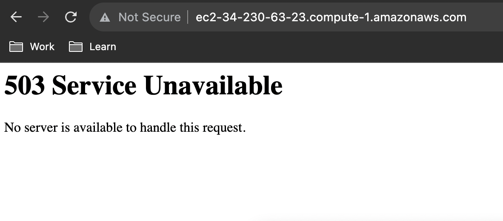

# HAPROXY SETUP IN AWS EC2 UBUNTU INSTANCE


#### Install HAProxy in the ubuntu instance
```sh
sudo apt update && sudo apt install -y haproxy
```

#### Change config by editing the haproxy.cfg file:
```sh
sudo vi /etc/haproxy/haproxy.cfg 
```

#### Config Snippet to add in the file(IP 172.31.44.104 is the private IP for the instance)
```
frontend http-in
    	bind 172.31.44.104:80
    	default_backend servers

backend servers
    	server server1 127.0.0.1:80
```

#### The entire config will look like this:
```
global
	log /dev/log	local0
	log /dev/log	local1 notice
	chroot /var/lib/haproxy
	stats socket /run/haproxy/admin.sock mode 660 level admin expose-fd listeners
	stats timeout 30s
	user haproxy
	group haproxy
	daemon

	# Default SSL material locations
	ca-base /etc/ssl/certs
	crt-base /etc/ssl/private

	# See: https://ssl-config.mozilla.org/#server=haproxy&server-version=2.0.3&config=intermediate
        ssl-default-bind-ciphers ECDHE-ECDSA-AES128-GCM-SHA256:ECDHE-RSA-AES128-GCM-SHA256:ECDHE-ECDSA-AES256-GCM-SHA384:ECDHE-RSA-AES256-GCM-SHA384:ECDHE-ECDSA-CHACHA20-POLY1305:ECDHE-RSA-CHACHA20-POLY1305:DHE-RSA-AES128-GCM-SHA256:DHE-RSA-AES256-GCM-SHA384
        ssl-default-bind-ciphersuites TLS_AES_128_GCM_SHA256:TLS_AES_256_GCM_SHA384:TLS_CHACHA20_POLY1305_SHA256
        ssl-default-bind-options ssl-min-ver TLSv1.2 no-tls-tickets

defaults
	log	global
	mode	http
	option	httplog
	option	dontlognull
        timeout connect 5000
        timeout client  50000
        timeout server  50000
	errorfile 400 /etc/haproxy/errors/400.http
	errorfile 403 /etc/haproxy/errors/403.http
	errorfile 408 /etc/haproxy/errors/408.http
	errorfile 500 /etc/haproxy/errors/500.http
	errorfile 502 /etc/haproxy/errors/502.http
	errorfile 503 /etc/haproxy/errors/503.http
	errorfile 504 /etc/haproxy/errors/504.http

frontend http-in
    	bind 172.31.44.104:80
    	default_backend servers

backend servers
    	server server1 127.0.0.1:80
```

#### Check if the Haproxy config file is valid:
```sh
sudo haproxy -c -f /etc/haproxy/haproxy.cfg
```

#### Restart Haproxy Service
```sh
sudo service haproxy restart
```

#### Check Haproxy Service status
```sh
sudo service haproxy status
```

#### The output should look like this:
```sh
● haproxy.service - HAProxy Load Balancer
     Loaded: loaded (/lib/systemd/system/haproxy.service; disabled; vendor preset: enabled)
     Active: active (running) since Mon 2023-10-09 10:13:52 UTC; 3s ago
       Docs: man:haproxy(1)
             file:/usr/share/doc/haproxy/configuration.txt.gz
    Process: 37063 ExecStartPre=/usr/sbin/haproxy -Ws -f $CONFIG -c -q $EXTRAOPTS (code=exited, status=0/SUCCESS)
   Main PID: 37065 (haproxy)
      Tasks: 2 (limit: 1141)
     Memory: 71.1M
        CPU: 108ms
     CGroup: /system.slice/haproxy.service
             ├─37065 /usr/sbin/haproxy -Ws -f /etc/haproxy/haproxy.cfg -p /run/haproxy.pid -S /run/haproxy-master.sock
             └─37067 /usr/sbin/haproxy -Ws -f /etc/haproxy/haproxy.cfg -p /run/haproxy.pid -S /run/haproxy-master.sock

Oct 09 10:13:52 ip-172-31-44-104 systemd[1]: haproxy.service: Deactivated successfully.
Oct 09 10:13:52 ip-172-31-44-104 systemd[1]: Stopped HAProxy Load Balancer.
Oct 09 10:13:52 ip-172-31-44-104 systemd[1]: Starting HAProxy Load Balancer...
Oct 09 10:13:52 ip-172-31-44-104 haproxy[37065]: [NOTICE]   (37065) : New worker #1 (37067) forked
Oct 09 10:13:52 ip-172-31-44-104 systemd[1]: Started HAProxy Load Balancer.
```

#### Check logs
```sh
tail -f /var/log/haproxy.log
```

Finally, Open the public IP or URL on the browser and you will see the below:
###### Public IP


###### Public URL
